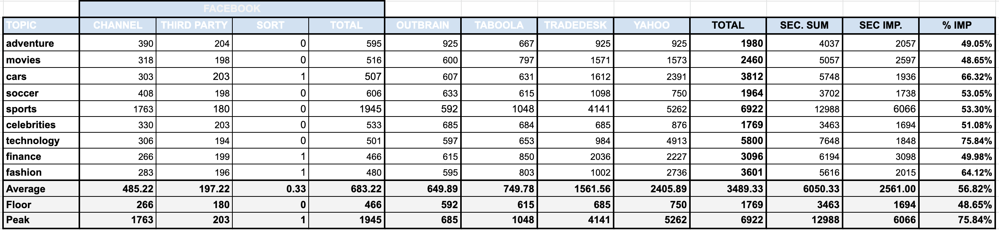

# Interest-meter
This project's intent is to check all the performance bottlenecks on the interest search endpoint. 
The query is usually fast but sometime even with the same arguments it can take huge time to execute.
The issue we are trying to address is [this](https://inpowered.atlassian.net/browse/BAC-4649). 

## Initial Demand
The first assumption is that the table is getting to much concurrent access and this is degrading the endpoint performance,
so initially the table INTEREST_LIST should be broke down into multiple tables with the interests split by the specific channel.

## Methodoloy
In order to assess the problem this interest meter project was created for. It creates a bunch of clients and triggers 
that endpoint as many times as possible using a local instance targeted to the development database. In addition to this, some additional 
lines of code were included in order to gather the metrics needed to analyse the information. 

The current feature is developed using the following sequence:
1. Client use the frontend app to search for interest
2. The frontend app calls the backend (nodejs) that acts as a proxy to the java backend
3. The backend(nodejs) invokes the java backend (benji-channels-api) through a load balancer that checks which 
   instance of the application should handle the request.
4. The endpoint is handled by  method `ChannelsEndpoint.getInterestForAllChannels` which delegates 
   this search to method `InteresetTargetingProcessor.getInterestForAllChannels`
5. The method `InteresetTargetingProcessor.getInterestForAllChannels` checks the cache (even if the request is 
   asking to refresh it aka not use cache) and uses an asynchronous thread executor to trigger one 
   thread per channel to do the actual search.

## Results
The following metrics were collected using a scenario of 10 topics being searched by 1-100 clients, and we observed that 
the times being consumed internally on the tasks didn't increase even with multiple clients invoking the service.

The above table shows the consumed by each processor and the last 4 columns shows a few numbers about the gains we observed
using multiple threads (one for each processor):
1. Total -> This is the total time consumed to fetch all the results for all the channels
2. Sec. Sum -> This is the total amount of time consumed by each processor individually summed by the topic being searched.
   This would be the result if we weren't using multiple thredas
3. Sec. Imp. (Seconds Improvement) - This is the amount of seconds we are saving by running multiple threads
4. % Imp - This is the percentage of the actual performance comparing to the scenario where we do all the searches in sequence (single threaded)

The performance improvement is huge when using parallel processing, but we have a bottleneck limiting the threads to one per 
channel, which in fact avoids us to be capable of handling more than one interest search concurrently in a single instance.

The picture above shows the average performance by each channel and individual step of a single processor. 
`FacebookInterestResolver` has 3 process inside, so I decided to measure each step of the whole process. This client was
used to trigger 1-100 simultaneous threads to search 10 topics against the local environment. We observed that the average
time for processing each step for all the process didn't vary significantly, although the final processing time on the main
thread increased a lot on a scenario of multiple searches happening on the same time. 

The internal time processing is shown on the pictures bellow:

Total Time per Topic       |  Average Time Per Channel
:-------------------------:|:-------------------------:
  |  

If we run the process many times this numbers still vary because they don't depend on the topic and the channel exclusively.
The first chart shows the total amount spent to search each topic. Each topic performance depends on the order it gets searched,
there's nothing specific to topic that influence its search performance as it showed aleatory times during the all the experiment.

## Findings

The main issue found is that the current thread executor pool is created using a limit threshold of the current number of active channels, 
so we are only able to execute 5 searches at a time. It causes the concurrent calls to be waiting until the all the spots on the thread pool
are busy. 

This explains the fact that the internal processing time doesn't vary based on the number of threads being triggered by this app. The time 
consumed by the whole search by a topic is impacted cause the thread pool doesn't have enough room to accommodate multiple calls. 

## References

All the data on this experiment can be found on [this spreadsheet](https://docs.google.com/spreadsheets/d/17Rq7Nte0sM0c6jrPEWI8XJpqSyylCFjcqnZeRiGHs-4/edit?usp=sharing)

## Notes
In order to merge the database optimizations done in [this PR](https://github.com/inPowered/benji-channels/pull/505) 
it's mandatory to run the following scripts in the following order:

1. [create_tables.sql](./docs/sql_scripts/create_tables.sql)
2. [copy_data.sql](./docs/sql_scripts/copy_data.sql)

